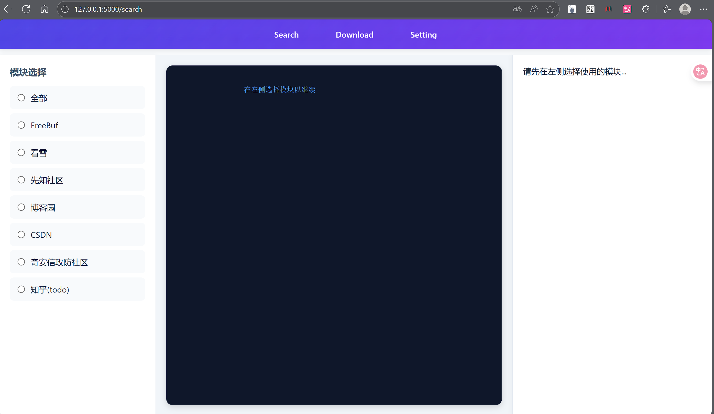
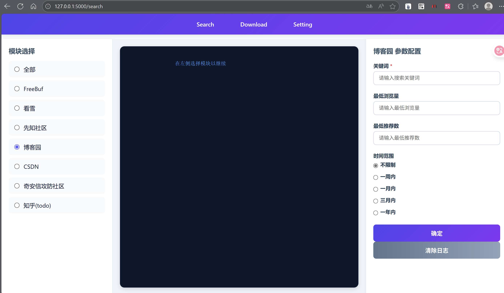
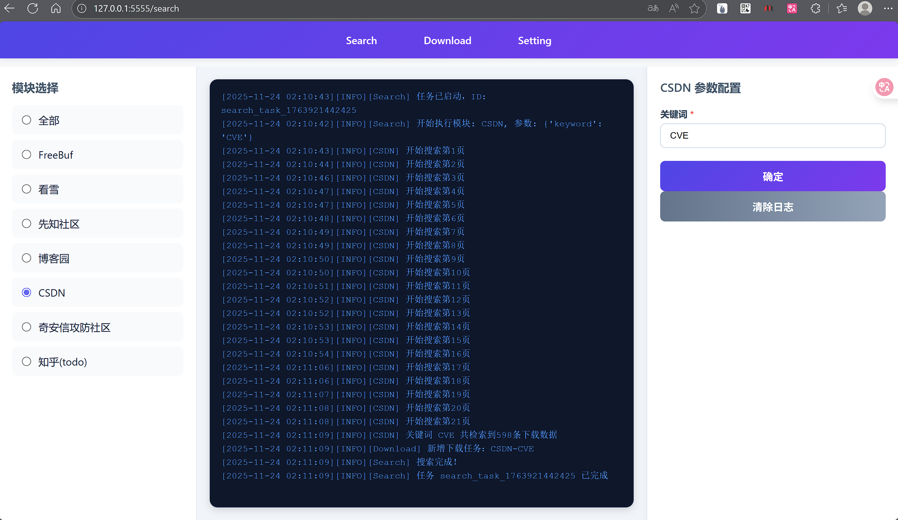
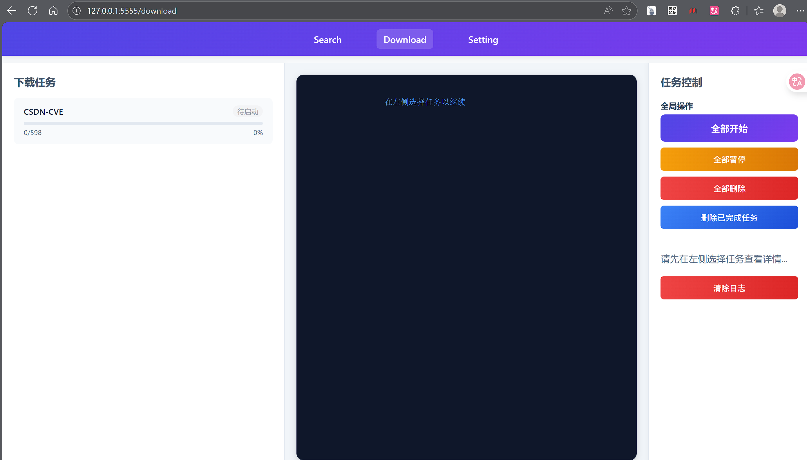
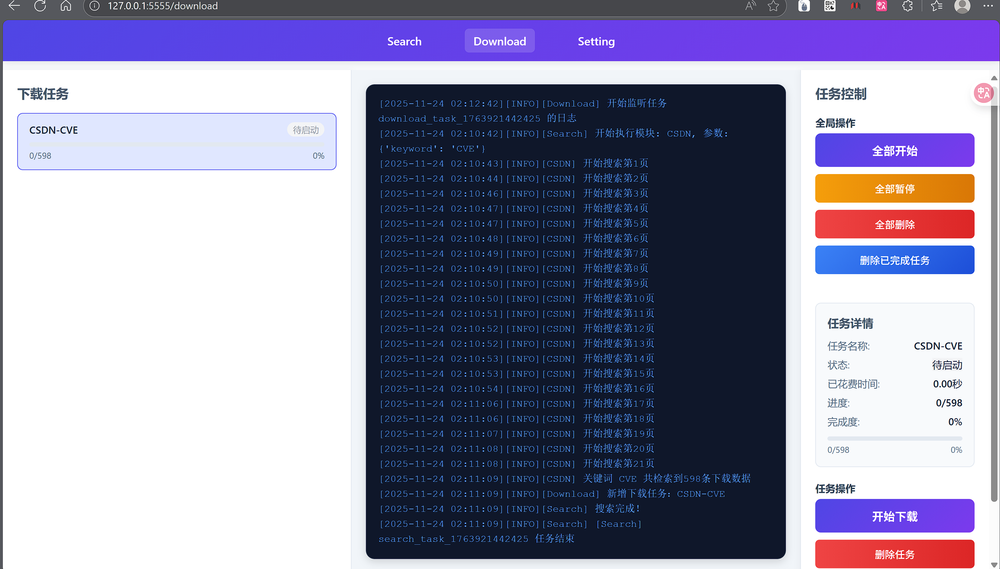
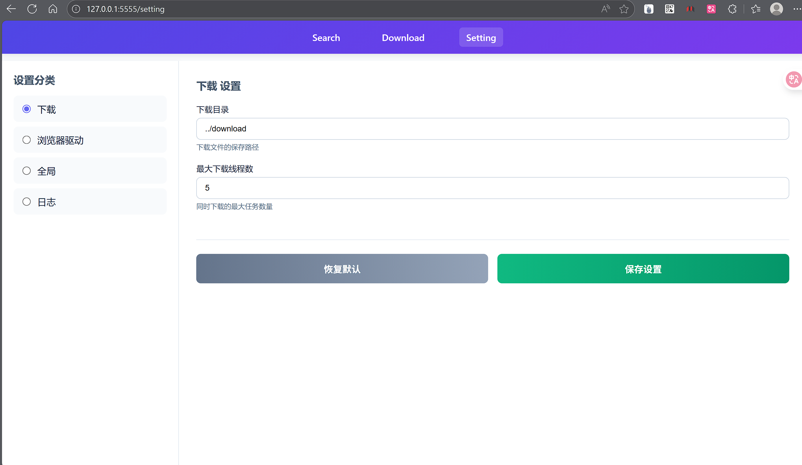

## 前言

​	众所周知，CTF网络安全竞赛线下赛很多情况下是断网的，但是允许使用本地知识库。因此本工具应运而生，本工具致力于帮助CTFer们下载各主流技术网站的博文以便断网环境下阅读。

​	当前项目仍处于初期阶段，能够基本完成基础功能，但仍会有一些BUG，欢迎随时提交issue及PR。

## 免责声明

​	本爬虫工具（以下简称“本工具”）由开发者个人/团队出于技术研究、学习交流或合法合规的数据采集目的而开发，仅供用户在遵守相关法律法规及网站使用条款的前提下使用。

1. **合法合规使用**
    用户在使用本工具时，必须确保其行为符合中华人民共和国及其他适用国家或地区的法律法规，包括但不限于《中华人民共和国网络安全法》《数据安全法》《个人信息保护法》以及目标网站的服务条款与 robots.txt 协议。严禁利用本工具从事任何非法、侵权、破坏性或违反公序良俗的行为。
2. **禁止滥用**
    严禁将本工具用于以下用途（包括但不限于）：
   - 对目标网站进行高频请求、拒绝服务攻击（DoS/DDoS）或其他形式的系统干扰；
   - 爬取涉及个人隐私、商业秘密、国家机密或其他受法律保护的信息；
   - 将爬取数据用于商业牟利、转售、恶意竞争等未经授权的用途。
3. **责任豁免**
    开发者不对用户使用本工具所引发的任何直接或间接后果承担责任，包括但不限于：
   - 因违反法律法规或网站条款导致的法律纠纷、行政处罚或民事赔偿；
   - 因不当使用造成的目标网站服务中断、数据丢失或系统损坏；
   - 因依赖本工具获取的数据而做出的错误决策或行为。
4. **风险自担**
    用户理解并同意，使用本工具即视为已充分知悉相关法律风险与技术风险，并自愿承担全部责任。建议在使用前咨询法律专业人士，确保行为合法合规。
5. **开源与修改说明**
    本工具为开源项目，任何基于本项目的二次开发、分发或修改版本，均须保留本免责声明，并对其衍生行为独立承担责任。

开发者保留随时修改本声明的权利，恕不另行通知。

未特殊说明的部分，需遵循`GNU General Public License v3.0`协议

## 环境要求

- Python 3.10及以上（更低版本未经测试）
- Windows 10及以上（更低版本未经测试）

## 当前受支持模块

- FreeBuf
- 看雪
- 先知社区
- 博客园
- CSDN
- 奇安信攻防社区

各站点的参数、元素与交互逻辑等可能随时发生变化，因此无法保证持久可用性。

## 使用说明

​	首次使用前，应当确保已安装python3.10及以上版本，并安装相应Edge或Chrome浏览器

​	安装python库：

```shell
pip install -r requirements.txt
```

​	在config.toml中进行基础配置（建议保持默认）

```toml
[global]
debug = false  # 是否开启调试模式
platform = "Windows"  # 运行平台

[driver]
browser_type = "chrome"  # 浏览器类型
use_local_driver = false  # 是否强制使用本地驱动
local_driver_path = ""  # 本地驱动路径，use_local_driver若为true，则使用该路径

[download]
path = "download"  # 下载文件保存路径
max_workers = 5  # 最大允许线程数

[log]
is_save = true  # 是否保存日志
path = "logs.txt"  # 日志文件保存路径
max_lines = 1000000  # 最大保存行数
encoding = "utf-8"  # 日志编码
```

​	启动程序：

```shell
python app.py
```

​	访问`http://127.0.0.1:5555`访问网页管理端：



​	主要有三个页面：`search`、`download`、`setting`

​	`search`主要负责执行查询任务，这一页面分为左中右三部分。

​	其中左侧为模块选择，在这里可以选择需要使用的模块，其中`全部`模块较为特殊，当使用它时，会同时再调用其他的模块。

​	中间为日志部分，会实时展示运行情况。

​	右侧是单个模块的具体管理部分：



​	输入选择对应参数后点击确定即可开始搜索任务：



​	当至少完成一项搜索任务后，接下来可以转向`download`部分：



​	点击左侧下载任务栏中的单项任务可以看到任务详情：



​	点击开始即可，在运行过程中，可随时暂停，点击`全部开始`，将会将所有任务设置为`等待中`，当存在空闲进程时将启动`等待中`的任务。

	最后`setting`页面可进行系统配置，修改将实时同步至`config.toml`，部分设置需要重启程序才会生效




## todo

- 知乎模块
- CSDN反爬处理
- CSDN用户登录功能
- 博客园自动化反爬


## 更新日志

- [2025.11.25] 基础项目上传

- [2025.11.26] BUG修复

  - chore(update): .gitignore，requirements.txt更新

  - fix(FreeBuf): 针对FreeBuf新增的TLS检测进行了绕过
  - fix(Search): 修复了“在模块调用搜索功能时若出现错误，未能及时清理异常任务导致新任务无法启动”的BUG
  - fix(CNblogs):  修复了当禁用调试模式时，浏览器自动启用无头模式导致无法手动通过验证码的问题
  - docx(README): README文档更新

